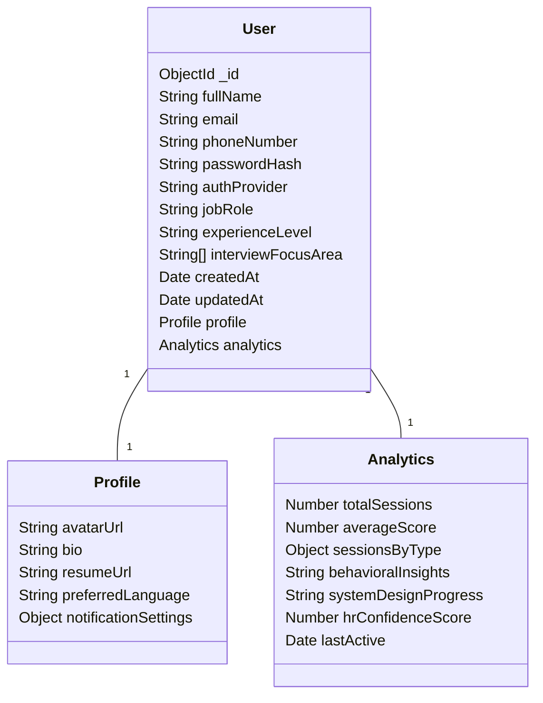
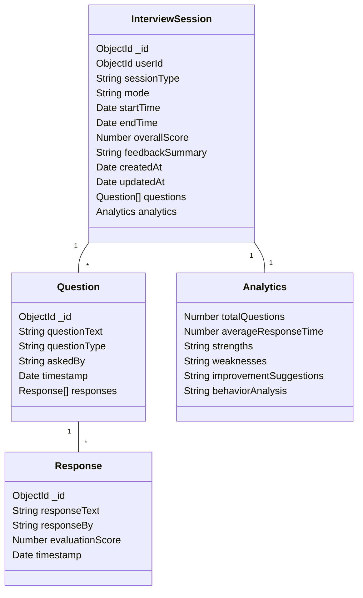
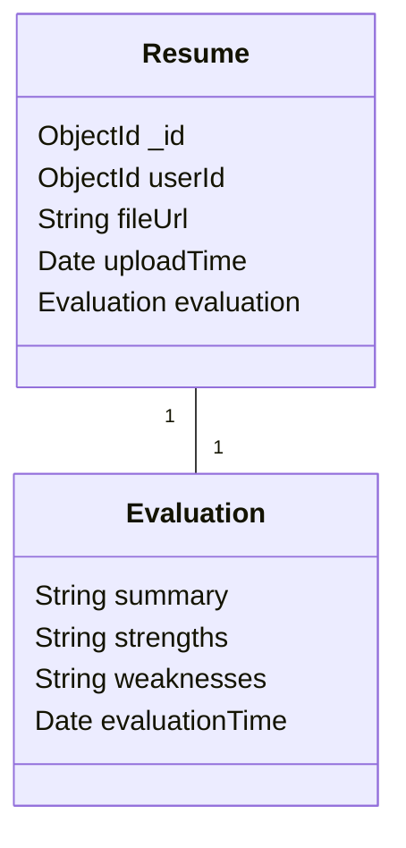
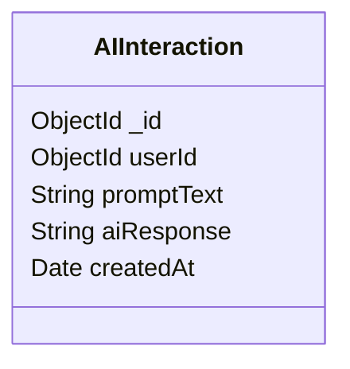

# 🧠 NeuroVue – AI-Powered Interview Assistant (React Native)

> 🚀 *AI That Prepares You for the Real Interview.*

NeuroVue is a cross-platform React Native mobile application designed to revolutionize how users prepare and perform in job interviews. Whether during a live web interview or a mock session, NeuroVue listens to questions in real-time, transcribes them, and generates intelligent answers using OpenAI and cutting-edge AI technologies.

## 📱 Features

- 🎙️ **Live Voice Listening:**  
  Captures real-time voice during online or web interviews.

- 📝 **Speech-to-Text Transcription:**  
  Accurately converts spoken questions into readable text.

- 🤖 **AI Answer Generation:**  
  Uses OpenAI's GPT to produce contextually appropriate, job-relevant answers instantly.

- 💬 **Mock Interview Mode:**  
  Practice with AI-generated interview questions and receive instant feedback.

- 🔊 **Text-to-Speech (TTS):**  
  Converts AI answers back into natural-sounding voice.

- 📈 **Analytics & Feedback:**  
  Provides performance reports with improvement suggestions.

- 📜 **Resume Evaluation:**  
  Upload and evaluate resumes using AI-driven feedback.

- 🧾 **Interview History:**  
  Store and review past sessions, responses, and feedback.

## 📂 Project Structure

```plaintext
NeuroVue/
│
├── src/
│   ├── components/        # Reusable UI components
│   ├── screens/           # All app screens (SignUp, Home, Interview, etc.)
│   ├── navigation/        # Stack/Tab navigation setup
│   ├── services/          # API integrations (OpenAI, STT, TTS)
│   ├── utils/             # Utility functions
│   └── assets/            # Images, fonts, icons
│
├── .env                   # API keys and env configs
├── App.js                 # Entry point
└── package.json
```

## 🛠️ Technology Stack

| Layer | Technologies |
|-------|--------------|
| Frontend | React Native, TypeScript, Redux/Zustand |
| Voice | react-native-voice, Whisper API, Google STT |
| AI | OpenAI GPT-4 (or GPT-3.5), LangChain (optional) |
| TTS | Google Cloud TTS, react-native-tts |
| Auth | Firebase Auth / Supabase |
| Storage | Firebase Firestore / MongoDB |
| Cloud | Firebase / AWS / Vercel backend (optional) |

## 🔧 Installation

1. Clone the repository:
```bash
git clone https://github.com/yourusername/NeuroVue-ReactNative-App.git
cd NeuroVue-ReactNative-App
npm install
```

2. Set up your `.env` file with the following:
```env
OPENAI_API_KEY=your_openai_key
GOOGLE_CLOUD_API_KEY=your_google_key
FIREBASE_API_KEY=your_firebase_key
```

3. Run the app:
```bash
npx react-native run-android
# or
npx react-native run-ios
```

## 🖼️ UI Screens

- 🟣 Onboarding
- 🟣 Sign In / Sign Up
- 🟣 Home Dashboard
- 🟣 Live Interview Listener
- 🟣 Mock Interview
- 🟣 Resume Evaluator
- 🟣 Interview History
- 🟣 Profile & Settings

> 👉 View Wireframes (Coming Soon)

## 🛠️ Future Enhancements

- AI-generated voice mimicry for personalized answers
- Scheduled interview practice with AI mentors
- Multilingual support
- Video response simulation mode
- Employer-side dashboard for real hiring use-cases

## 🧑‍💻 Contributing

Contributions are welcome! Please fork the repository and submit a pull request.

```bash
git checkout -b feature/your-feature-name
git commit -m "Add: Your feature"
git push origin feature/your-feature-name
```

Open a PR and we'll review it!

## 📜 License

This project is licensed under the MIT License.

## 🤝 Credits

Built with ❤️ by Sameer Prashant Jadhav and contributors.
Powered by OpenAI, Google Cloud, and the React Native ecosystem.

## Database Schema

The NeuroVue application uses MongoDB with the following document structure:

### Core Collections

#### Users Collection


#### Interview Sessions Collection


#### Resumes Collection


#### AI Interactions Collection


### Document Structure Examples

#### User Document
```json
{
  "_id": ObjectId(),
  "fullName": "John Doe",
  "email": "john@example.com",
  "phoneNumber": "+1234567890",
  "passwordHash": "hashed_password",
  "authProvider": "google",
  "jobRole": "Software Engineer",
  "experienceLevel": "mid",
  "interviewFocusArea": ["technical", "system_design"],
  "createdAt": ISODate(),
  "updatedAt": ISODate(),
  "profile": {
    "avatarUrl": "https://...",
    "bio": "Experienced developer...",
    "resumeUrl": "https://...",
    "preferredLanguage": "en",
    "notificationSettings": {
      "email": true,
      "push": true
    }
  },
  "analytics": {
    "totalSessions": 10,
    "averageScore": 85.5,
    "sessionsByType": {
      "technical": 5,
      "behavioral": 3,
      "system_design": 2
    },
    "behavioralInsights": "...",
    "systemDesignProgress": "...",
    "hrConfidenceScore": 80,
    "lastActive": ISODate()
  }
}
```

#### Interview Session Document
```json
{
  "_id": ObjectId(),
  "userId": ObjectId(),
  "sessionType": "technical",
  "mode": "mock",
  "startTime": ISODate(),
  "endTime": ISODate(),
  "overallScore": 88.5,
  "feedbackSummary": "Strong technical knowledge...",
  "createdAt": ISODate(),
  "updatedAt": ISODate(),
  "questions": [
    {
      "_id": ObjectId(),
      "questionText": "Explain REST API...",
      "questionType": "technical",
      "askedBy": "AI",
      "timestamp": ISODate(),
      "responses": [
        {
          "_id": ObjectId(),
          "responseText": "REST API is...",
          "responseBy": "user",
          "evaluationScore": 90,
          "timestamp": ISODate()
        }
      ]
    }
  ],
  "analytics": {
    "totalQuestions": 10,
    "averageResponseTime": 45.5,
    "strengths": "Good problem-solving...",
    "weaknesses": "Could improve on...",
    "improvementSuggestions": "Practice more...",
    "behaviorAnalysis": "Shows good communication..."
  }
}
```

### Key Features
- Document-oriented data model
- Embedded documents for related data
- References for cross-collection relationships
- Indexes on frequently queried fields
- Timestamp tracking for creation and updates
- Comprehensive analytics tracking
- Flexible schema design

### Indexes
- Users: email (unique)
- Interview Sessions: userId, sessionType
- AI Interactions: userId, createdAt
- Resumes: userId

### Data Validation
- Enumerated types for:
  - Auth providers (email, google, linkedin)
  - Experience levels (fresher, junior, mid, senior, lead)
  - Session types (technical, behavioural, system_design, hr)
  - Session modes (live, mock)
  - Question types (technical, behavioural, system_design, hr)
  - Response sources (user, AI)
