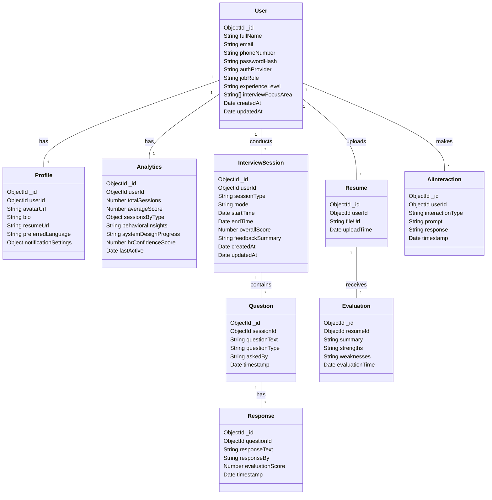
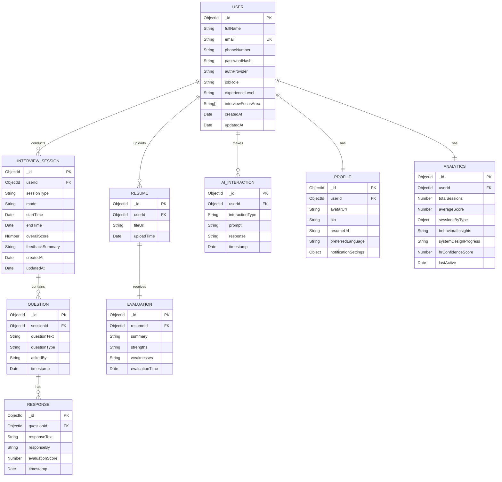

# 🧠 NeuroVue – AI-Powered Interview Assistant (React Native)

> 🚀 *AI That Prepares You for the Real Interview.*

NeuroVue is a cross-platform React Native mobile application designed to revolutionize how users prepare and perform in job interviews. Whether during a live web interview or a mock session, NeuroVue listens to questions in real-time, transcribes them, and generates intelligent answers using OpenAI and cutting-edge AI technologies.

## 📱 Features

- 🎙️ **Live Voice Listening:**  
  Captures real-time voice during online or web interviews.

- 📝 **Speech-to-Text Transcription:**  
  Accurately converts spoken questions into readable text.

- 🤖 **AI Answer Generation:**  
  Uses OpenAI's GPT to produce contextually appropriate, job-relevant answers instantly.

- 💬 **Mock Interview Mode:**  
  Practice with AI-generated interview questions and receive instant feedback.

- 🔊 **Text-to-Speech (TTS):**  
  Converts AI answers back into natural-sounding voice.

- 📈 **Analytics & Feedback:**  
  Provides performance reports with improvement suggestions.

- 📜 **Resume Evaluation:**  
  Upload and evaluate resumes using AI-driven feedback.

- 🧾 **Interview History:**  
  Store and review past sessions, responses, and feedback.

## 📂 Project Structure

```plaintext
NeuroVue/
│
├── src/
│   ├── components/        # Reusable UI components
│   ├── screens/           # All app screens (SignUp, Home, Interview, etc.)
│   ├── navigation/        # Stack/Tab navigation setup
│   ├── services/          # API integrations (OpenAI, STT, TTS)
│   ├── utils/             # Utility functions
│   └── assets/            # Images, fonts, icons
│
├── .env                   # API keys and env configs
├── App.js                 # Entry point
└── package.json
```

## 🛠️ Technology Stack

| Layer | Technologies |
|-------|--------------|
| Frontend | React Native, TypeScript, Redux/Zustand |
| Voice | react-native-voice, Whisper API, Google STT |
| AI | OpenAI GPT-4 (or GPT-3.5), LangChain (optional) |
| TTS | Google Cloud TTS, react-native-tts |
| Auth | Firebase Auth / Supabase |
| Storage | Firebase Firestore / MongoDB |
| Cloud | Firebase / AWS / Vercel backend (optional) |

## 🔧 Installation

1. Clone the repository:
```bash
git clone https://github.com/yourusername/NeuroVue-ReactNative-App.git
cd NeuroVue-ReactNative-App
npm install
```

2. Set up your `.env` file with the following:
```env
OPENAI_API_KEY=your_openai_key
GOOGLE_CLOUD_API_KEY=your_google_key
FIREBASE_API_KEY=your_firebase_key
```

3. Run the app:
```bash
npx react-native run-android
# or
npx react-native run-ios
```

## 🖼️ UI Screens

- 🟣 Onboarding
- 🟣 Sign In / Sign Up
- 🟣 Home Dashboard
- 🟣 Live Interview Listener
- 🟣 Mock Interview
- 🟣 Resume Evaluator
- 🟣 Interview History
- 🟣 Profile & Settings

> 👉 View Wireframes (Coming Soon)

## 🛠️ Future Enhancements

- AI-generated voice mimicry for personalized answers
- Scheduled interview practice with AI mentors
- Multilingual support
- Video response simulation mode
- Employer-side dashboard for real hiring use-cases

## 🧑‍💻 Contributing

Contributions are welcome! Please fork the repository and submit a pull request.

```bash
git checkout -b feature/your-feature-name
git commit -m "Add: Your feature"
git push origin feature/your-feature-name
```

Open a PR and we'll review it!

## 📜 License

This project is licensed under the MIT License.

## 🤝 Credits

Built with ❤️ by Sameer Prashant Jadhav and contributors.
Powered by OpenAI, Google Cloud, and the React Native ecosystem.

## Database Schema

The NeuroVue application uses MongoDB with the following document structure:

### Core Collections



### Key Features
- Document-oriented data model
- Embedded documents for related data
- References for cross-collection relationships
- Indexes on frequently queried fields
- Timestamp tracking for creation and updates
- Comprehensive analytics tracking
- Flexible schema design

### Indexes
- Users: email (unique)
- Interview Sessions: userId, sessionType
- AI Interactions: userId, createdAt
- Resumes: userId

### Data Validation
- Enumerated types for:
  - Auth providers (email, google, linkedin)
  - Experience levels (fresher, junior, mid, senior, lead)
  - Session types (technical, behavioural, system_design, hr)
  - Session modes (live, mock)
  - Question types (technical, behavioural, system_design, hr)
  - Response sources (user, AI)

## Detailed ER Diagram



### Entity Relationships Explanation

1. **User Management**
   - Each User has exactly one Profile (1:1)
   - Each User has exactly one Analytics record (1:1)
   - A User can conduct multiple Interview Sessions (1:N)
   - A User can upload multiple Resumes (1:N)
   - A User can have multiple AI Interactions (1:N)

2. **Interview Flow**
   - Each Interview Session contains multiple Questions (1:N)
   - Each Question can have multiple Responses (1:N)
   - Questions are linked to their parent Interview Session
   - Responses are linked to their parent Question

3. **Resume Management**
   - Each Resume belongs to one User
   - Each Resume has exactly one Evaluation (1:1)
   - Evaluations are directly linked to their respective Resumes

4. **Analytics and Tracking**
   - User Analytics tracks overall performance metrics
   - AI Interactions log all AI-related activities
   - Timestamps are maintained for all major operations

### Key Constraints

1. **Primary Keys**
   - All entities use ObjectId as their primary key
   - Composite keys are not used for simplicity

2. **Foreign Keys**
   - All relationships are maintained through ObjectId references
   - Cascading deletes are implemented where appropriate

3. **Unique Constraints**
   - User email must be unique
   - Profile and Analytics are unique per User
   - Evaluation is unique per Resume

4. **Indexing Strategy**
   - Primary keys are automatically indexed
   - Foreign keys are indexed for faster joins
   - Frequently queried fields have additional indexes
   - Compound indexes for common query patterns

### Data Integrity Rules

1. **User Data**
   - Email must be unique and valid
   - Password must be hashed before storage
   - Profile must be created with User creation

2. **Interview Data**
   - Session must have valid start and end times
   - Questions must be associated with a valid session
   - Responses must be linked to valid questions

3. **Resume Data**
   - File URL must be valid and accessible
   - Evaluation must be completed after upload
   - Only one active resume per user

4. **Analytics Data**
   - Scores must be within valid ranges
   - Timestamps must be in chronological order
   - Metrics must be updated in real-time

This ER diagram and documentation provides a comprehensive view of the database structure and relationships in the NeuroVue application. It serves as a reference for developers and helps maintain data integrity throughout the application's lifecycle.
